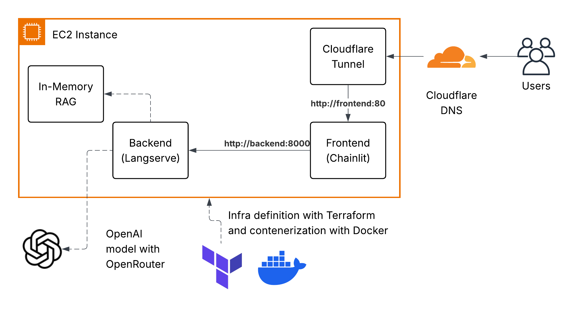

# Project Overview

TODO: Añadir cloudflare

## 

## Architecture Diagram



* The infrastructure is deployed using terraform. This program will create an EC2 instance, where it will install docker, pull the repository, and run the application via docker compose.
* The docker compose will run three containers:
    * The backend container that will run the langchain application with its own RAG.
    * The frontend container that will run the chainlit application, added as an extra for a nice UI.
    * The cloudflare-tunnel container, added as an extra that will provide a secure connection between the users and the application.

## How to deploy

This project requires terraform to be installed. It also requires AWS credentials, an OpenRouter API key and a Cloudflare token.

1. Install terraform
2. Create a `terraform.tfvars` file inside the infra folder with the following keys (based on `terraform.tfvars.example`):

```
aws_region              = "us-east-1" # or any other region
aws_access_key_id       = ""
aws_secret_access_key   = ""
openrouter_api_key      = ""
cloudflare_tunnel_token = ""
```

3. Run `make init` and then `make plan` to see what will be deployed
4. Run `make apply` to deploy the infrastructure
5. Once the infrastructure is deployed, terraform will output the EC2 Public IP address, which you can use to access the application (http://<ec2_public_ip>:80).
6. You can remove the infrastructure by running `make destroy`.

## What is not included on this project

* CI/CD: Right now, terraform is used to deploy the infrastructure and the application. A better aproach would be to use, 
for example, github actions to deploy the application when a new commit is pushed to the main branch.
* Testing: This project doesn't include any tests. It runs by pure will power.
* Logging & Monitoring
* Security
* Scaling
* Load Balancing
* etc.