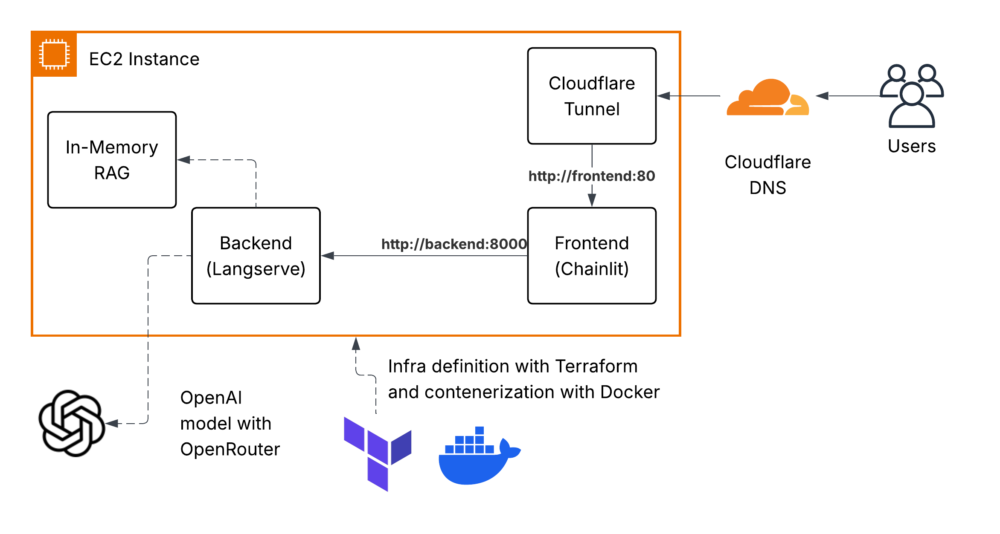

# Project Overview

This project is my solution to the Promtior Assignment for the AI Engineer position.

First, I want to clarify that I did get assistance from an AI to make this project (specifically, Claude Code), with an 
exception to the backend, as the assignment asked to build it from the documentation. I would also like to add that I 
didn't use the AI to build automatically the code. Instead, I used it to solve specific tasks, such as building the 
script to deploy the containers inside EC2, and creating the scaffolding for the frontend and infrastructure. I tried to
expose my knowledge of the assignment to the best of my ability, while also trying to value my own time :)

## Architecture Diagram



* The infrastructure is deployed using terraform. This program will create an EC2 instance, where it will install docker, pull the repository, and run the application via docker compose.
* The docker compose will run three containers:
    * The backend container that will run the langchain application with its own pre-built RAG.
    * The frontend container that will run the chainlit application, added as an extra for a nice UI.
    * The cloudflare-tunnel container, added as an extra that will provide a secure connection between the users and the application, with a proper domain name. Also, it avoids the need to expose the EC2 instance to the internet.
* I know that these last two containers were not asked in the assignment, but I ended up adding them because I thought it would make the app more complete.

## Challenges found

I didn't find any major challenges in this project. Maybe the most difficult part was to learn how to deploy langchain, 
as the company is intentionally hiding the LangServe deployment instructions in favor of using their own managed service.
Most chatbots I've made have been built using tools like n8n or Pydantic AI with FastAPI (which I consider it to be a more robust
and production-ready framework). However, this project was a good opportunity to learn how to use langchain :)

## How to deploy

This project requires terraform to be installed. It also requires AWS credentials, an OpenRouter API key and a Cloudflare token.

1. Install terraform
2. Create a `terraform.tfvars` file inside the infra folder with the following keys (based on `terraform.tfvars.example`):

```
aws_region              = "us-east-1" # or any other region
aws_access_key_id       = ""
aws_secret_access_key   = ""
openrouter_api_key      = ""
cloudflare_tunnel_token = ""
```

3. Run `make init` and then `make plan` to see what will be deployed
4. Run `make apply` to deploy the infrastructure
5. You can remove the infrastructure by running `make destroy`.

## What is not included on this project

* CI/CD: Right now, terraform is used to deploy the infrastructure and the application. A better approach would be to use, 
for example, github actions to deploy the application when a new commit is pushed to the main branch.
* Testing: This project doesn't include any tests. It runs by pure will power.
* A more robust memory and RAG setup. Both are very basic and the RAG is stored in RAM.
* Logging & Monitoring
* Security
* Scaling
* Load Balancing
* etc.